# Classic Platform vs Adaptive Platform
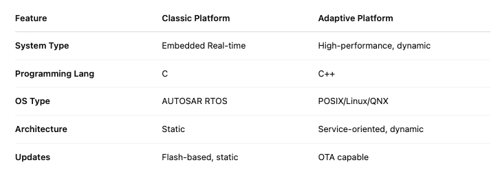
# Classic Platform
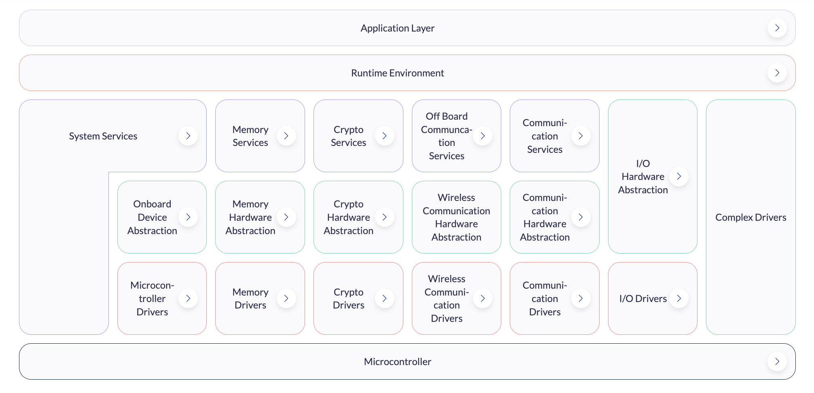
# Doc: Explanation of Application Interface of AD/ADAS vehicle motion control
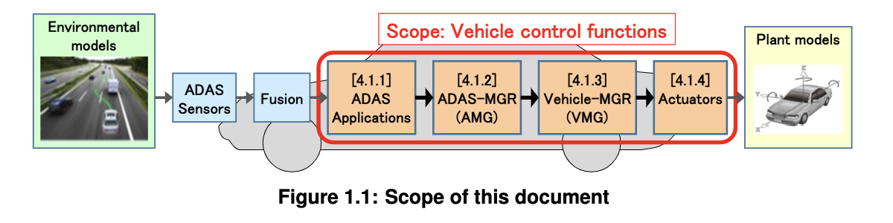
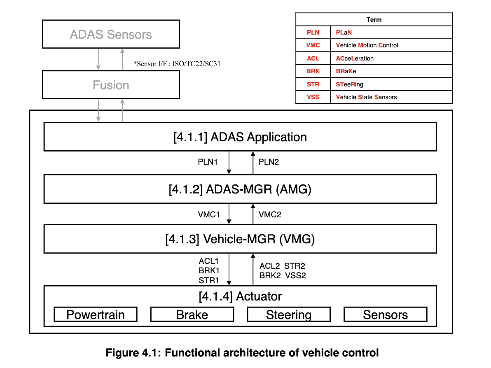
# Doc: Explanation of Application Interfaces of the HMI, Multimedia and Telematics Domain
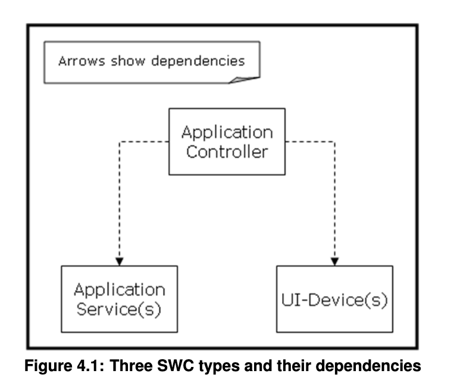
### Example: AUTOSAR PDC application
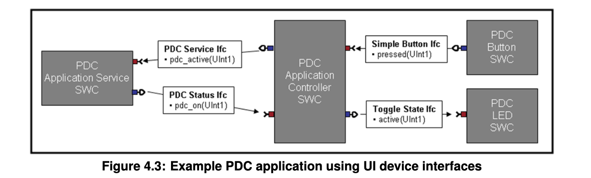
# Doc: Explanation of Application Interfaces of the Chassis Domain
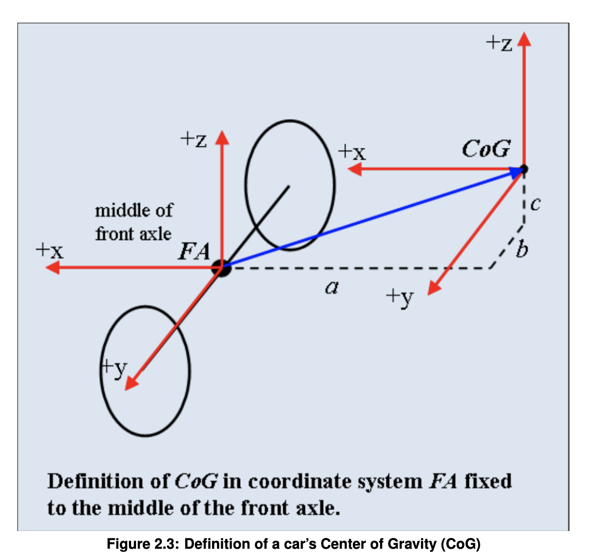
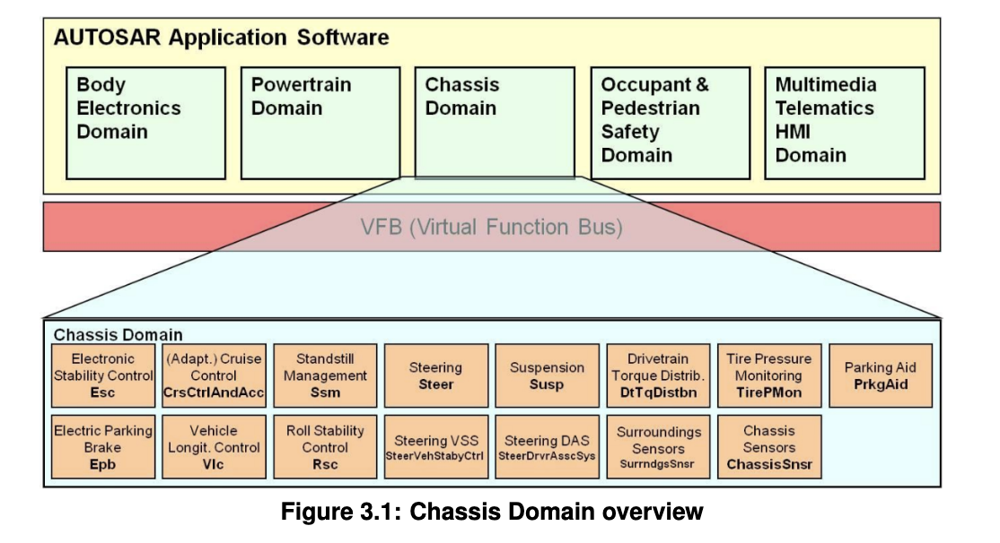
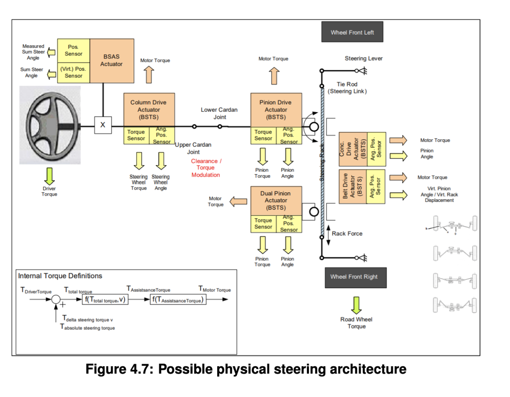
# Adaptive Platform
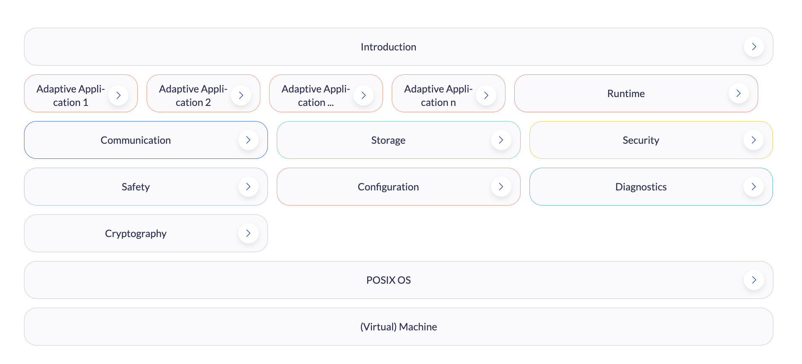
# Doc: Explanation of Sensor Interfaces
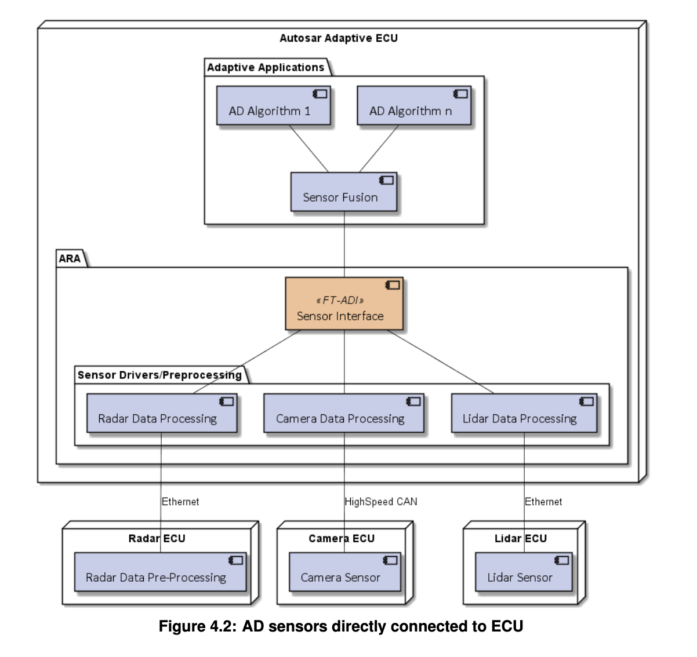
# Doc: Explanation of Adaptive Platform Software Architecture
## Example
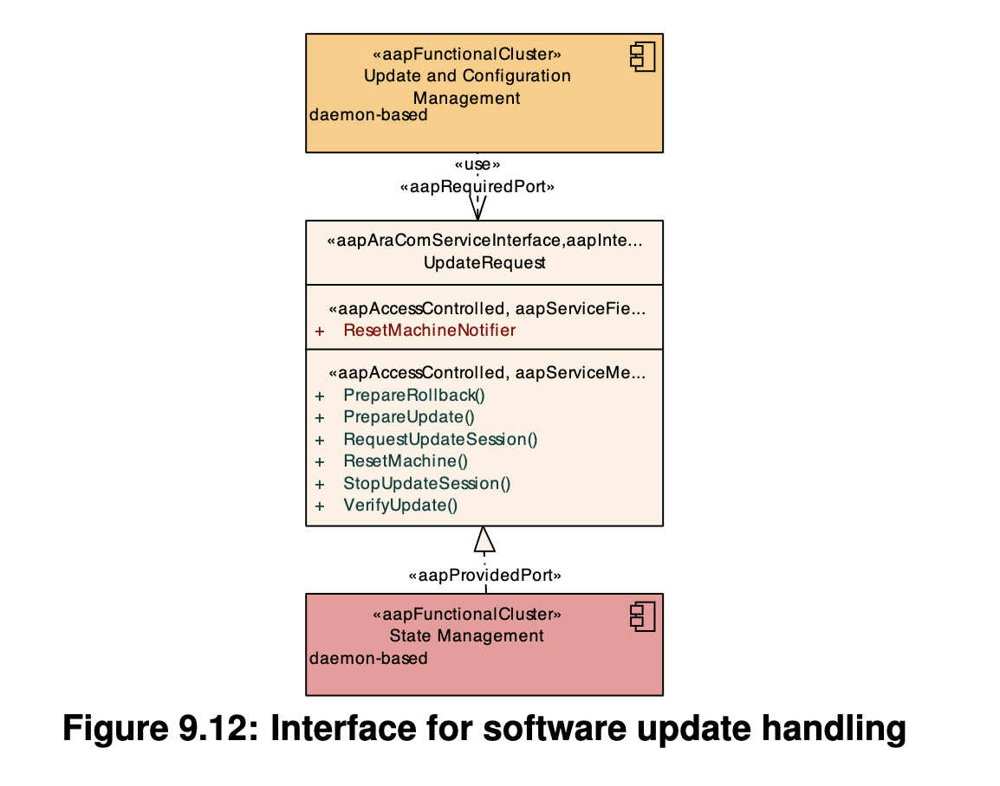
## Example 
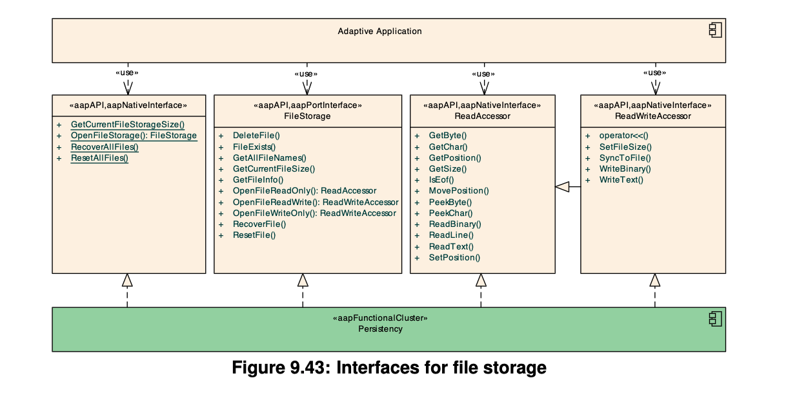